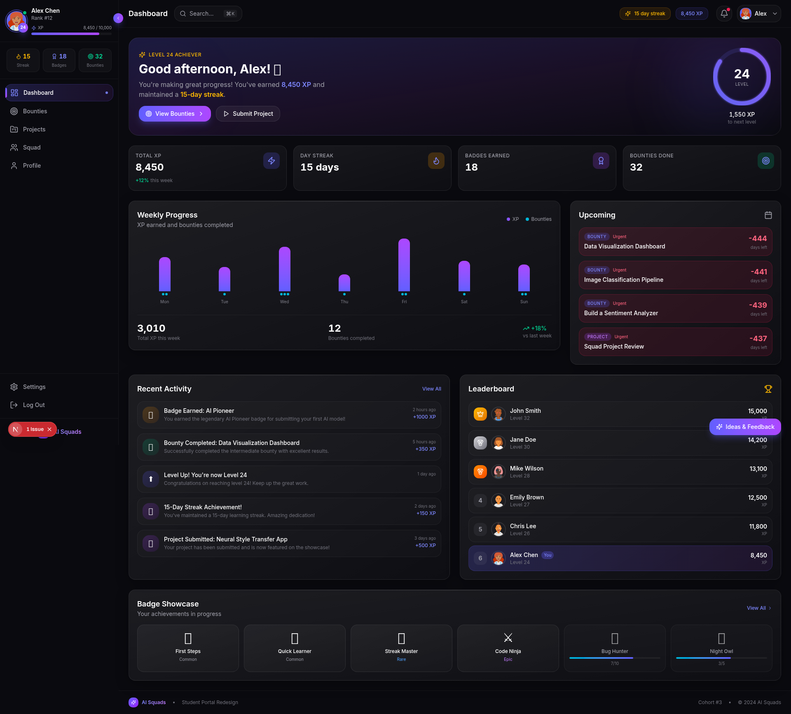
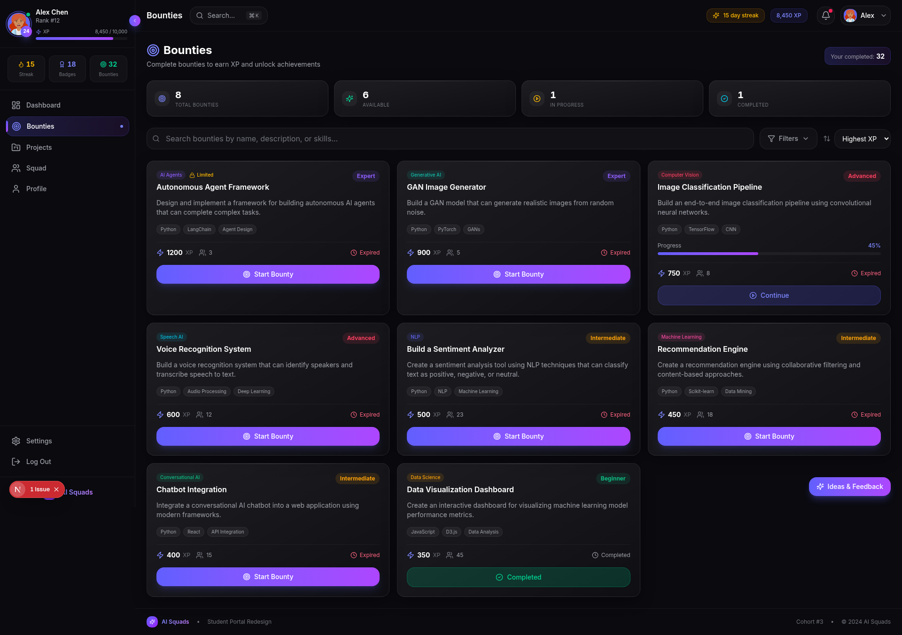
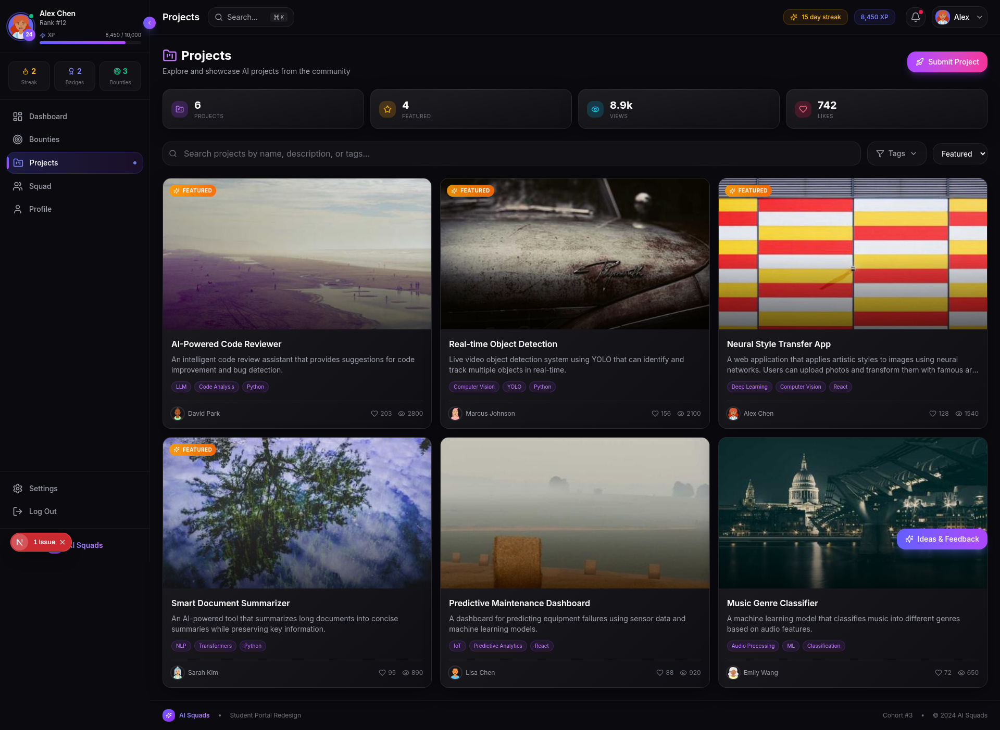
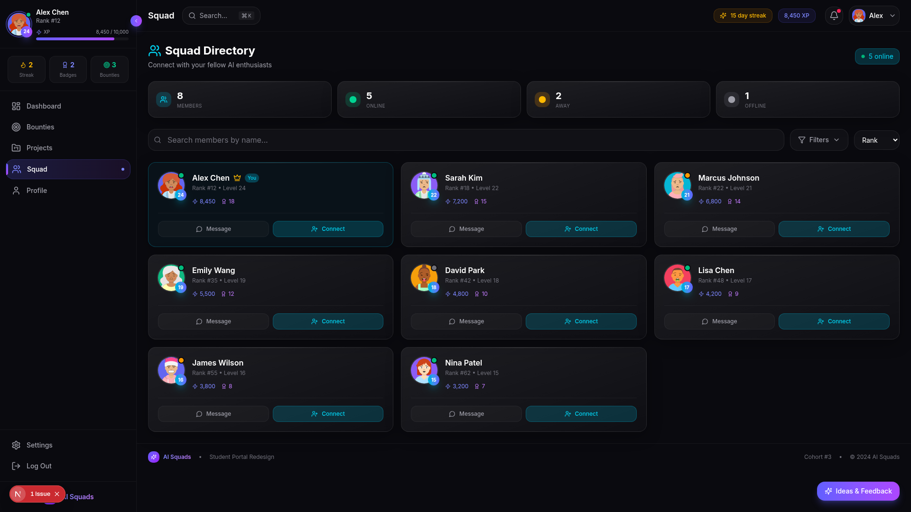
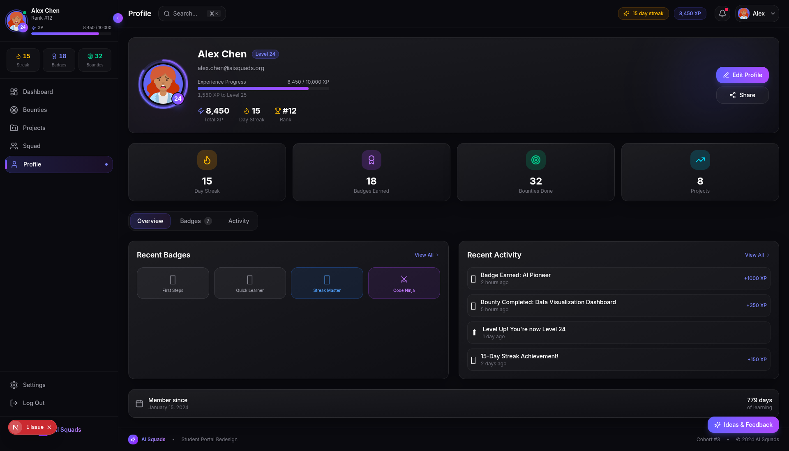
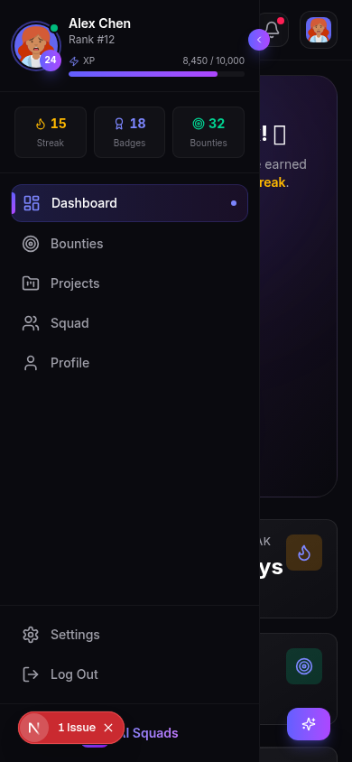

# AI Squads Student Portal - Premium Redesign 🚀

[](https://nextjs.org/)
[](https://www.typescriptlang.org/)
[](https://tailwindcss.com/)

> A complete redesign of the AI Squads Student Portal (portal.aisquads.org) - transforming a functional interface into a premium, gamified learning experience.

## 📸 Screenshots

### Dashboard


### Bounties


### Projects


### Squad Directory


### Profile


### Mobile Responsive


---

## 🎯 Challenge Submission

This project is a submission for the **AI Squads Student Portal Redesign Challenge**. The goal was to redesign the portal with a fresh visual direction, improved UX, and premium features.

## ✨ Key Features

### 🎮 Gamification System
- **XP & Leveling** - Earn XP for completing bounties, submitting projects, and maintaining streaks
- **Badge System** - 4 rarity tiers (Common, Rare, Epic, Legendary) with distinct visual treatments
- **Streak Tracking** - Daily engagement tracking with fire animations
- **Leaderboards** - Real-time ranking with relative position visualization

### 🎨 Premium Design
- **Glassmorphism** - Frosted glass cards with backdrop blur effects
- **Gradient Accents** - Indigo-to-purple color scheme throughout
- **Micro-animations** - Fade-in, scale, and count-up animations
- **Dark Theme** - Eye-friendly dark palette optimized for extended use

### 📱 Responsive Design
- Collapsible sidebar that adapts to screen size
- Mobile-optimized header with quick navigation
- Touch-friendly interactive elements
- Fluid grid layouts for all breakpoints

### 🖥️ Pages

| Page | Description |
|------|-------------|
| **Dashboard** | Personalized hero section, weekly progress chart, upcoming deadlines, activity feed, leaderboard preview |
| **Bounties** | Filterable bounty cards with difficulty levels, XP rewards, deadline countdowns, and progress tracking |
| **Projects** | Portfolio showcase with featured projects, thumbnails, engagement metrics, and tag filtering |
| **Squad** | Member directory with online status, level badges, and quick action buttons |
| **Profile** | Achievement showcase, badge progress, activity history, and XP progression ring |

## 🛠️ Tech Stack

- **Framework**: Next.js 15 with App Router
- **Language**: TypeScript
- **Styling**: Tailwind CSS
- **Icons**: Lucide React
- **Animations**: CSS keyframes + transitions

## 🚀 Getting Started

### Prerequisites

- Node.js 18+ or Bun
- npm, yarn, or bun

### Installation

```bash
# Clone the repository
git clone https://github.com/Mohamed74567/ai-squads-portal-redesign.git

# Navigate to project directory
cd ai-squads-portal-redesign

# Install dependencies
bun install
# or
npm install

# Start development server
bun run dev
# or
npm run dev
```

Open [http://localhost:3000](http://localhost:3000) in your browser.

## 📁 Project Structure

```
src/
├── app/
│   ├── page.tsx          # Main portal page with navigation
│   ├── layout.tsx        # Root layout
│   └── globals.css       # Design system & animations
├── components/
│   ├── Dashboard.tsx     # Dashboard with charts & activity feed
│   ├── Bounties.tsx      # Bounties section with filters
│   ├── Projects.tsx      # Projects showcase
│   ├── Squad.tsx         # Member directory
│   ├── Profile.tsx       # User profile page
│   ├── Sidebar.tsx       # Collapsible navigation sidebar
│   ├── GlassCard.tsx     # Premium glass card component
│   ├── ProgressRing.tsx  # Animated SVG progress rings
│   ├── AnimatedNumber.tsx# Counting animations
│   └── StatCard.tsx      # Stats display cards
└── lib/
    ├── mockData.ts       # Mock data for demonstration
    └── utils.ts          # Utility functions
```

## 📝 Design Decisions Write-Up

### Problems Identified in Original Design

1. **Visual Design Issues**: The original dark theme lacked visual depth. Cards appeared static and lifeless with minimal accent colors to guide attention.

2. **Gamification Shortcomings**: The "0 Badges Earned" display was discouraging for new users. Progress indicators were simple dots without context.

3. **Information Architecture**: The sidebar felt sparse and underutilized. Navigation between sections lacked visual continuity.

4. **Interactive Deficiencies**: Hover states and interactive feedback were minimal. Empty states were not properly handled.

### Design Solutions

**Dark Theme**: Reduces eye strain during extended use, preferred by developers, and allows vibrant accent colors to stand out effectively.

**Glassmorphism**: Creates visual depth and hierarchy, adds a premium feel without overwhelming, and separates content layers intuitively.

**XP & Leveling**: Provides clear progression metrics, motivates continued engagement, and creates tangible achievement milestones.

**Progress Rings**: Visually engaging representation of progress, more impactful than progress bars, and works well at various sizes.

**Animated Numbers**: Draws attention to key metrics, adds dynamic feel to static data, and creates a sense of achievement.

**Badge Rarity System**: Creates aspiration and collection motivation, provides clear differentiation between achievements.

### Design Inspiration

- **Linear** - Clean sidebar navigation and keyboard shortcuts
- **Vercel** - Dark theme implementation and glassmorphism
- **Stripe** - Data visualization and progress indicators
- **Notion** - Card-based content organization
- **Gaming platforms** (Steam, Xbox) - Gamification elements

## 🔧 Customization

### Colors
The design system uses CSS custom properties defined in `globals.css`:

```css
--accent-primary: #6366f1;    /* Indigo */
--accent-secondary: #8b5cf6;  /* Purple */
--accent-success: #10b981;    /* Emerald */
--accent-warning: #f59e0b;    /* Amber */
--accent-error: #f43f5e;      /* Rose */
```

## 📄 License

This project is open source and available under the MIT License.

## 🙏 Acknowledgments

- Design inspiration from Linear, Vercel, and Stripe
- Gamification concepts from gaming platforms
- Built with Next.js, Tailwind CSS, and Lucide Icons

---

**Made with ❤️ for the AI Squads Design Challenge**

**Author**: Mohamed (moeid475@gmail.com)  
**GitHub**: https://github.com/Mohamed74567/ai-squads-portal-redesign
